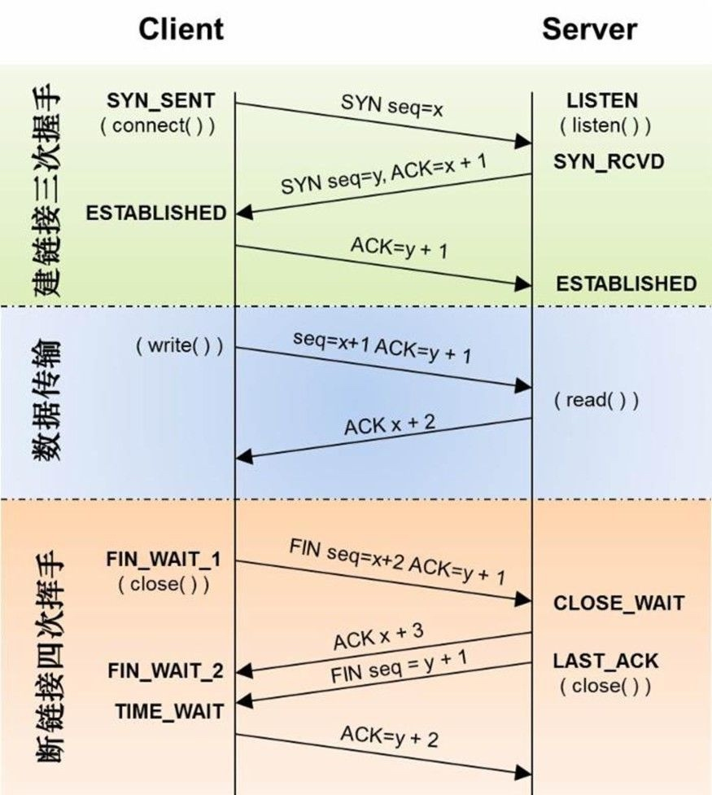

# HTTP传输流程

## 三次握手
为了准确无误地将数据送达目标处，TCP 协议采用了**三次握手**（three-way handshaking）策略。用 TCP 协议把数据包送出去后，TCP不会对传送后的情况置之不理，它一定会向对方确认是否成功送达。

之所以**3次握手**是因为通信双方需要明确对方收发能力正常。

`第一次握手`：发送端发送信息给接收端。确认发送端的发送能力，接收端的接收能力正常。

`第二次握手`：接收端发送信息给发送端。确认发送端的接收能力正常，接收端的发送能力也正常。

`第三次握手`：发送端发送信息给接收端。告知一切正常。

第三次握手已经可以传递数据包了。

3次握手用于连接建立阶段。

## 4次挥手
4次挥手又名**连接终止协议**。

`第一次挥手`：客户端打算关闭连接，此时会发送一个 TCP 首部 `FIN` 标志位被置为 `1` 的报文，也即 `FIN` 报文，之后客户端进入 `FIN_WAIT_1` 状态。

`第二次挥手`：服务端收到该报文后，就向客户端发送 `ACK` 应答报文，接着服务端进入 `CLOSED_WAIT` 状态。客户端收到服务端的 `ACK` 应答报文后，之后进入 `FIN_WAIT_2` 状态。

`第三次挥手`：等待服务端处理完数据后，也向客户端发送 `FIN` 报文，之后服务端进入 `LAST_ACK` 状态。

`第四次挥手`：客户端收到服务端的 `FIN` 报文后，回一个 `ACK` 应答报文，之后进入 `TIME_WAIT` 状态。

服务器接收到`ACK`，进入`CLOSE`，至此接收端已经完成连接的关闭。
发送端在经过 `2MSL` 一段时间后，自动进入 `CLOSE` 状态，至此发送端也完成连接的关闭。

之所以需要4次挥手，是因为服务端通常需要等待完成数据的发送和处理，所以服务端的 `ACK` 和 `FIN` 一般都会分开发送。所以会比3次握手多了一次。

HTTP数据传输流程。

## 为什么使用https
用 `SSL`建立安全通信线路之后，就可以在这条线路上进行 `HTTP`通信了。与 SSL组合使用的 `HTTP` 被称为 `HTTPS`。

通常，`HTTP` 直接和 `TCP` 通信。当使用 `SSL` 时，则演变成先和 `SSL`通信，再由 `SSL`和 `TCP` 通信了。简言之，所谓 `HTTPS`，其实就是身披`SSL`协议这层外壳的 `HTTP`。

`HTTPS` 解决了`HTTP`的这些不足。
* 通信使用明文（不加密），内容可能会被窃听(`https` 会通过 `SSL`建立安全的通信线路，实现通信加密。)
* 不验证通信方的身份，因此有可能遭遇伪装(`https` 使用了一种被称为证书的手段，可用于确定方。)
* 无法证明报文的完整性，所以有可能已遭篡改(`https`提供认证和加密处理及摘要功能。)

HTTP+ 加密 + 认证 + 完整性保护 = HTTPS

